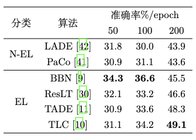

# Awesome Long-Tailed Learning

[Homework] Fanpeng Meng's code of final work for Image Processing 2022Spring, school of AIA, HUST.

I surveyed current **deep long-tailed learning**, and chose some of them for experiments. Here are the codes. See detail in the [report](./assets/survey.pdf). 

## Report

[PDF](./assets/survey.pdf) (Chinese version)

Result in the report:

## Code List

* [LADE](./LADE)
* [PaCo](./PaCo)
* [BBN](./BBN)
* [ResLT](./ResLT)
* [TADE](./TADE)
* [TLC](./TLC)
